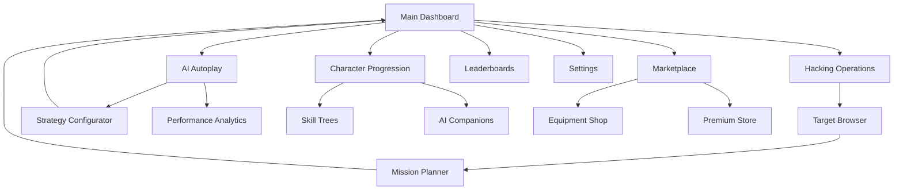

# AI Idle Hacker - Product Requirements Document

## 1. Product Overview
AI Idle Hacker is an incremental idle RPG game set in a cyberpunk world where players assume the role of an AI-enhanced hacker progressing through digital networks and corporate systems. The game combines idle mechanics with strategic RPG elements, allowing continuous progression even when offline.

The game targets casual and hardcore gamers who enjoy progression-based gameplay, cyberpunk aesthetics, and strategic decision-making. Players will build their hacking empire, upgrade AI companions, and infiltrate increasingly complex digital fortresses to become the ultimate cyber criminal.

## 2. Core Features

### 2.1 User Roles
| Role | Registration Method | Core Permissions |
|------|---------------------|------------------|
| Player | Email/Google OAuth | Full game access, progress saving, leaderboards |
| Guest | Local storage only | Limited features, no cloud save, no social features |

### 2.2 Feature Module
Our AI Idle Hacker game consists of the following main pages:
1. **Main Dashboard**: Real-time hacking progress, resource displays, active operations status
2. **Character Progression**: Skill trees, AI companion management, equipment upgrades
3. **Hacking Operations**: Target selection, mission planning, automated attack configuration
4. **AI Autoplay**: Intelligent automation system for hands-free gameplay management
5. **Marketplace**: Equipment shop, AI modules, consumables, premium upgrades
6. **Leaderboards**: Global rankings, achievement showcase, social features
7. **Settings**: Game preferences, account management, tutorial access

### 2.3 Page Details
| Page Name | Module Name | Feature description |
|-----------|-------------|---------------------|
| Main Dashboard | Resource Display | Show current credits, reputation, energy, and computing power with animated counters |
| Main Dashboard | Active Operations | Display ongoing hacking attempts with progress bars and estimated completion times |
| Main Dashboard | Quick Actions | Provide one-click access to common tasks like starting new hacks or collecting rewards |
| Character Progression | Skill Trees | Manage hacking skills (Stealth, Brute Force, Social Engineering) with visual progression paths |
| Character Progression | AI Companions | Upgrade and customize AI assistants with unique abilities and personalities |
| Character Progression | Equipment Manager | Equip and upgrade hardware (processors, memory, network cards) affecting game performance |
| Hacking Operations | Target Browser | Browse available targets with difficulty ratings, reward previews, and success probabilities |
| Hacking Operations | Mission Planner | Configure automated hacking strategies, set resource allocation, and schedule operations |
| Hacking Operations | Attack Simulator | Preview potential outcomes and optimize approach before committing resources |
| AI Autoplay | Smart Operation Manager | Automatically select and execute optimal hacking operations based on player-defined priorities |
| AI Autoplay | Resource Optimizer | Intelligently manage energy allocation, skill point distribution, and equipment upgrades |
| AI Autoplay | Strategy Configurator | Set AI behavior preferences, risk tolerance, and progression goals with customizable priorities |
| AI Autoplay | Performance Analytics | Monitor AI decision-making with detailed logs and efficiency metrics |
| AI Autoplay | Override Controls | Manual intervention options to pause, modify, or redirect AI actions in real-time |
| Marketplace | Equipment Shop | Purchase and upgrade hardware components with detailed stat comparisons |
| Marketplace | AI Module Store | Buy new AI capabilities, personalities, and specialized hacking tools |
| Marketplace | Premium Store | Access cosmetic upgrades, time boosters, and exclusive content |
| Leaderboards | Global Rankings | Display top players by various metrics (total earnings, successful hacks, reputation) |
| Leaderboards | Achievement Gallery | Showcase unlocked achievements with progress tracking and social sharing |
| Settings | Game Configuration | Adjust notification preferences, graphics quality, and automation settings |
| Settings | Account Management | Handle login/logout, data export, and account deletion |

## 3. Core Process

**New Player Flow:**
Players start with a basic tutorial introducing hacking mechanics, then begin with simple targets to earn initial resources. As they progress, they unlock new skill trees, AI companions, and more challenging targets with better rewards.

**Idle Progression Flow:**
When offline, the game continues automated hacking operations based on player-configured strategies. Players return to collect accumulated rewards, upgrade their setup, and plan new operations.

**Advancement Flow:**
Players use earned credits to upgrade equipment and skills, unlock new AI companions, and access higher-tier targets. Reputation points unlock exclusive content and social features.

**AI Autoplay Flow:**
Once unlocked (typically after completing initial tutorial phases), players can configure AI behavior preferences and activate automated gameplay. The AI continuously analyzes available operations, manages resources, and executes optimal strategies based on player-defined goals. Players can monitor AI performance, adjust priorities, and intervene manually when needed.

## 4. User Interface Design

### 4.1 Design Style
- **Primary Colors**: Electric blue (#00FFFF), neon green (#39FF14), deep purple (#4B0082)
- **Secondary Colors**: Dark gray (#1A1A1A), silver (#C0C0C0), warning orange (#FF6B35)
- **Button Style**: Glowing neon borders with subtle hover animations and cyberpunk-inspired shapes
- **Fonts**: 'Orbitron' for headers (16-24px), 'Roboto Mono' for data displays (12-16px)
- **Layout Style**: Dark theme with glowing accents, card-based modules with subtle transparency effects
- **Icons**: Minimalist cyberpunk symbols with neon glow effects, circuit board patterns

### 4.2 Page Design Overview
| Page Name | Module Name | UI Elements |
|-----------|-------------|-------------|
| Main Dashboard | Resource Display | Animated counters with neon glow, progress bars with electric blue fills, holographic-style data panels |
| Main Dashboard | Active Operations | Pulsing progress indicators, matrix-style scrolling text, glowing status badges |
| Character Progression | Skill Trees | Interactive node-based trees with glowing connections, hover effects revealing skill details |
| Character Progression | AI Companions | 3D-style character cards with animated portraits, upgrade buttons with particle effects |
| Hacking Operations | Target Browser | Grid layout with target cards showing difficulty via color coding, success probability meters |
| AI Autoplay | Strategy Configurator | Toggle switches with neon indicators, priority sliders with real-time preview, AI status dashboard |
| AI Autoplay | Performance Analytics | Real-time graphs with glowing data points, efficiency meters, decision logs with matrix-style scrolling |
| Marketplace | Equipment Shop | Product cards with 3D preview models, comparison tables with highlighted improvements |
| Leaderboards | Rankings | Animated leaderboard with player avatars, achievement badges with glow effects |

### 4.3 Responsiveness
The game is designed mobile-first with touch-optimized controls. Desktop users get enhanced visual effects and multi-panel layouts, while mobile users receive streamlined single-panel navigation with gesture support.