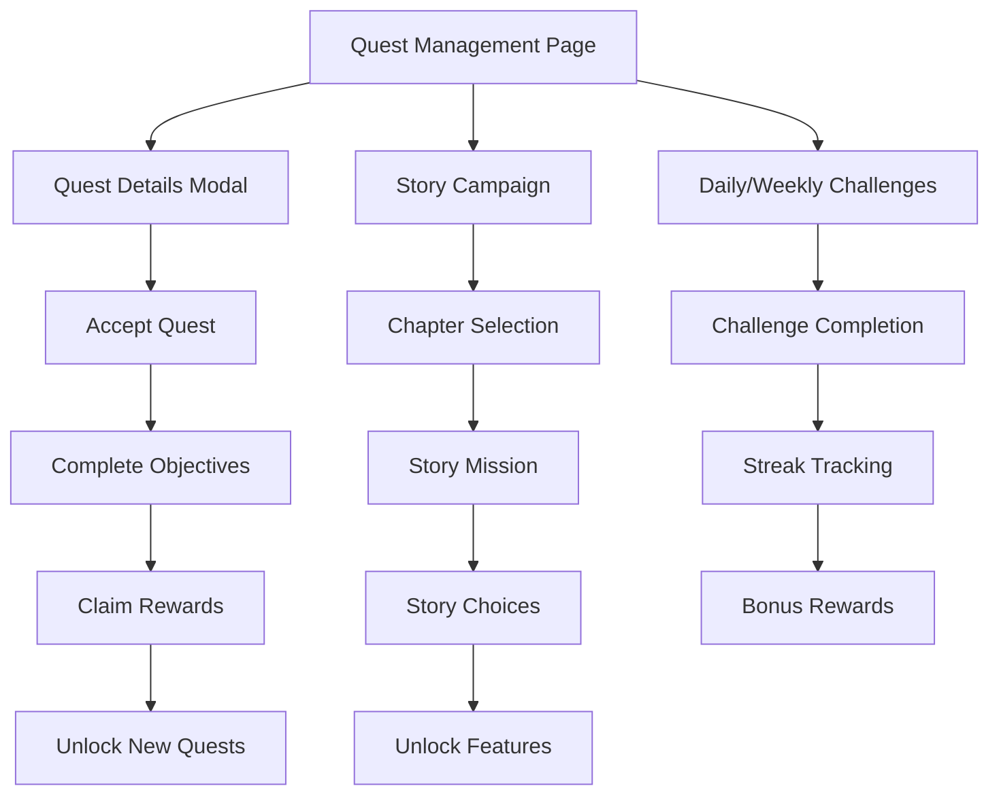

# AI Idle Hacker - Quest System Design Document

## 1. Product Overview

The Quest System is a comprehensive progression and engagement framework designed to enhance the AI Idle Hacker game experience. It provides structured objectives, narrative context, and meaningful rewards to guide players through their hacking journey while maintaining the idle game's core mechanics.

The system addresses the current limitation of having only a basic achievement system by introducing multiple quest types, progressive storylines, and dynamic objectives that adapt to player progress and playstyle.

## 2. Core Features

### 2.1 User Roles

| Role | Registration Method | Core Permissions |
|------|---------------------|------------------|
| Player | Existing game account | Can accept quests, track progress, claim rewards |
| Quest Giver (NPC) | System-generated | Provides quests, validates completion, distributes rewards |

### 2.2 Feature Module

Our quest system requirements consist of the following main components:

1. **Quest Management Page**: quest list, progress tracking, reward claiming interface
2. **Quest Details Modal**: objective breakdown, reward preview, acceptance/abandonment options
3. **Story Campaign Page**: narrative progression, chapter unlocks, character development
4. **Daily/Weekly Challenges**: rotating objectives, streak tracking, bonus rewards
5. **Achievement Gallery**: comprehensive achievement system, milestone tracking, showcase
6. **Quest Notification System**: progress updates, completion alerts, new quest notifications

### 2.3 Page Details

| Page Name | Module Name | Feature description |
|-----------|-------------|---------------------|
| Quest Management | Quest List | Display active, available, and completed quests with filtering and sorting options |
| Quest Management | Progress Tracker | Real-time progress bars, objective completion status, time remaining for timed quests |
| Quest Management | Reward Interface | Preview rewards, claim completed quest rewards, track total rewards earned |
| Quest Details Modal | Objective Breakdown | Detailed quest requirements, step-by-step objectives, completion criteria |
| Quest Details Modal | Reward Preview | Show credits, XP, items, and special rewards before accepting quest |
| Quest Details Modal | Quest Actions | Accept new quests, abandon active quests, view quest lore and background |
| Story Campaign | Narrative Progression | Sequential story missions with branching paths and character development |
| Story Campaign | Chapter System | Unlock new chapters based on level and previous quest completion |
| Story Campaign | Character Development | Introduce NPCs, build relationships, unlock special storylines |
| Daily/Weekly Challenges | Rotating Objectives | Auto-generated daily and weekly quests with varying difficulty and rewards |
| Daily/Weekly Challenges | Streak System | Track consecutive completion streaks with escalating bonus rewards |
| Daily/Weekly Challenges | Leaderboard Integration | Compare challenge completion with other players |
| Achievement Gallery | Comprehensive Tracking | Expand beyond current single achievement to 50+ diverse achievements |
| Achievement Gallery | Milestone System | Multi-tier achievements with progressive rewards and recognition |
| Achievement Gallery | Showcase Features | Display rare achievements, completion statistics, and player accomplishments |
| Quest Notifications | Progress Updates | Real-time notifications for objective completion and quest progress |
| Quest Notifications | Completion Alerts | Celebrate quest completion with visual effects and reward summaries |
| Quest Notifications | New Quest Alerts | Notify players of newly available quests and time-sensitive opportunities |

## 3. Core Process

### Player Quest Flow
1. Player accesses Quest Management page from main navigation
2. Browse available quests filtered by type (Story, Daily, Weekly, Achievement)
3. Select quest to view detailed objectives and rewards in modal
4. Accept quest and begin working toward objectives through normal gameplay
5. Receive real-time progress notifications as objectives are completed
6. Return to Quest Management to claim rewards upon completion
7. Unlock new quests based on level, story progress, and achievements

### Story Campaign Flow
1. Player unlocks Story Campaign at level 5
2. Complete introductory chapter to learn game mechanics
3. Progress through sequential chapters with increasing difficulty
4. Make choices that affect story branching and available quests
5. Unlock special equipment, skills, or game features through story completion
6. Access endgame content and prestige system through story completion



## 4. User Interface Design

### 4.1 Design Style

- **Primary Colors**: Cyber blue (#00f5ff), Matrix green (#00ff41)
- **Secondary Colors**: Dark purple (#6b46c1), Warning orange (#f59e0b)
- **Button Style**: Rounded corners with neon glow effects and hover animations
- **Font**: Orbitron for headers, JetBrains Mono for quest descriptions and objectives
- **Layout Style**: Card-based design with dark backgrounds and neon accents
- **Icon Style**: Futuristic line icons with optional glow effects for completed items

### 4.2 Page Design Overview

| Page Name | Module Name | UI Elements |
|-----------|-------------|-------------|
| Quest Management | Quest List | Grid layout with quest cards, filter tabs, search bar, progress indicators |
| Quest Management | Progress Tracker | Animated progress bars, completion checkmarks, time countdown timers |
| Quest Management | Reward Interface | Reward icons with quantities, claim buttons with glow effects, total rewards counter |
| Quest Details Modal | Objective Breakdown | Numbered objective list, completion status icons, difficulty indicators |
| Quest Details Modal | Reward Preview | Reward cards with hover effects, rarity indicators, bonus multiplier displays |
| Story Campaign | Narrative Progression | Chapter map with unlock progression, character portraits, story text with typewriter effect |
| Story Campaign | Chapter System | Node-based progression map, locked/unlocked visual states, completion percentages |
| Daily/Weekly Challenges | Rotating Objectives | Timer displays, refresh countdowns, difficulty badges, streak counters |
| Achievement Gallery | Comprehensive Tracking | Achievement grid with completion states, progress bars, rarity borders |
| Quest Notifications | Progress Updates | Toast notifications with slide-in animations, progress increment displays |

### 4.3 Responsiveness

The quest system is designed mobile-first with responsive breakpoints at 768px and 1024px. Touch interactions are optimized for mobile devices with larger tap targets and swipe gestures for quest navigation. Desktop users benefit from hover effects and keyboard shortcuts for quest management.

## 5. Quest System Architecture

### 5.1 Data Structures

```typescript
interface Quest {
  id: string;
  title: string;
  description: string;
  type: 'story' | 'daily' | 'weekly' | 'achievement' | 'special';
  category: 'combat' | 'progression' | 'social' | 'exploration' | 'mastery';
  difficulty: 1 | 2 | 3 | 4 | 5;
  objectives: QuestObjective[];
  rewards: QuestReward[];
  prerequisites: QuestPrerequisite[];
  timeLimit?: number; // in milliseconds
  isRepeatable: boolean;
  status: 'locked' | 'available' | 'active' | 'completed' | 'failed';
  startedAt?: number;
  completedAt?: number;
  progress: QuestProgress;
}

interface QuestObjective {
  id: string;
  description: string;
  type: 'operation_complete' | 'credits_earn' | 'level_reach' | 'skill_upgrade' | 'equipment_purchase';
  target: number;
  current: number;
  isCompleted: boolean;
  isOptional: boolean;
}

interface QuestReward {
  type: 'credits' | 'experience' | 'reputation' | 'equipment' | 'skill_points' | 'special';
  amount: number;
  itemId?: string;
  rarity?: 'common' | 'rare' | 'epic' | 'legendary';
}

interface QuestPrerequisite {
  type: 'level' | 'quest_completed' | 'achievement_unlocked' | 'skill_level';
  value: number | string;
}
```

### 5.2 Quest Types

#### Story Quests
- **Purpose**: Provide narrative structure and tutorial progression
- **Examples**: "First Hack", "Corporate Infiltration", "The AI Conspiracy"
- **Rewards**: Major XP bonuses, unique equipment, story unlocks
- **Progression**: Linear with occasional branching choices

#### Daily Quests
- **Purpose**: Encourage daily engagement and routine play
- **Examples**: "Complete 3 operations", "Earn 5,000 credits", "Upgrade any equipment"
- **Rewards**: Moderate credits and XP, daily streak bonuses
- **Reset**: Every 24 hours at midnight UTC

#### Weekly Quests
- **Purpose**: Provide longer-term goals and substantial rewards
- **Examples**: "Complete 25 operations", "Reach level X", "Earn 100,000 credits"
- **Rewards**: Large credit bonuses, rare equipment, achievement progress
- **Reset**: Every Monday at midnight UTC

#### Achievement Quests
- **Purpose**: Recognize player milestones and mastery
- **Examples**: "Operation Master", "Credit Collector", "Skill Specialist"
- **Rewards**: Permanent bonuses, titles, cosmetic unlocks
- **Progression**: One-time completion with tiered variants

#### Special Event Quests
- **Purpose**: Limited-time content and seasonal engagement
- **Examples**: "Holiday Hack", "Anniversary Challenge", "Community Goal"
- **Rewards**: Exclusive items, limited-time bonuses, commemorative rewards
- **Availability**: Time-limited during special events

### 5.3 Quest Progression Mechanics

#### Objective Tracking
- Real-time progress updates during gameplay
- Multiple objective types with different completion criteria
- Optional objectives for bonus rewards
- Automatic progress saving and synchronization

#### Reward Distribution
- Immediate reward claiming upon quest completion
- Bonus multipliers for streak completion
- Rare reward chances with RNG elements
- Inventory management for equipment rewards

#### Difficulty Scaling
- Dynamic difficulty adjustment based on player level
- Prerequisite system to gate advanced content
- Balanced risk/reward ratios across difficulty tiers
- Optional challenge modes for experienced players

## 6. Integration with Existing Systems

### 6.1 Operations Integration
- Quest objectives automatically track operation completions
- Specific operation types can be required for targeted quests
- Success rates and efficiency metrics influence quest rewards
- AI autoplay system can prioritize quest-relevant operations

### 6.2 Skills Integration
- Skill level requirements for advanced quests
- Skill upgrade objectives in progression quests
- Skill-specific quest lines for specialized gameplay
- Skill point rewards for quest completion

### 6.3 Equipment Integration
- Equipment purchase and upgrade objectives
- Unique equipment rewards for story quest completion
- Equipment level requirements for high-tier quests
- Equipment bonuses affect quest completion efficiency

### 6.4 Achievement Integration
- Expand current single achievement to comprehensive system
- Achievement unlocks trigger new quest availability
- Cross-referencing between quest completion and achievement progress
- Achievement showcase integration with quest rewards

## 7. Implementation Roadmap

### Phase 1: Foundation (Weeks 1-2)
- Implement core quest data structures and interfaces
- Create basic quest management system in game store
- Design and implement Quest Management page UI
- Add quest progress tracking to existing game actions

### Phase 2: Core Quest Types (Weeks 3-4)
- Implement daily and weekly quest generation system
- Create quest objective tracking and completion logic
- Add reward distribution and claiming functionality
- Integrate quest notifications with existing notification system

### Phase 3: Achievement Expansion (Weeks 5-6)
- Expand achievement system from 1 to 50+ achievements
- Create Achievement Gallery page with comprehensive tracking
- Implement achievement unlock conditions and rewards
- Add achievement showcase features and statistics

### Phase 4: Story Campaign (Weeks 7-9)
- Design and implement story quest framework
- Create Story Campaign page with chapter progression
- Write initial story content and character development
- Add story choices and branching narrative elements

### Phase 5: Advanced Features (Weeks 10-12)
- Implement special event quest system
- Add quest difficulty scaling and prerequisites
- Create leaderboard integration for competitive quests
- Optimize performance and add analytics tracking

### Phase 6: Polish and Launch (Weeks 13-14)
- Comprehensive testing and bug fixes
- UI/UX refinements and accessibility improvements
- Documentation and player onboarding materials
- Soft launch with gradual feature rollout

## 8. Success Metrics

### Engagement Metrics
- Daily active users completing at least one quest
- Average session time increase after quest system implementation
- Quest completion rates across different difficulty levels
- Player retention rates at 7, 14, and 30 days

### Progression Metrics
- Time to complete story campaign chapters
- Distribution of player levels and skill progression
- Equipment upgrade frequency and patterns
- Achievement unlock rates and completion statistics

### Monetization Impact
- In-game currency earning and spending patterns
- Premium feature adoption rates
- Player lifetime value improvements
- Conversion rates from free to premium features

This quest system design provides a comprehensive framework for enhancing player engagement while maintaining the core idle game mechanics that make AI Idle Hacker enjoyable and accessible.