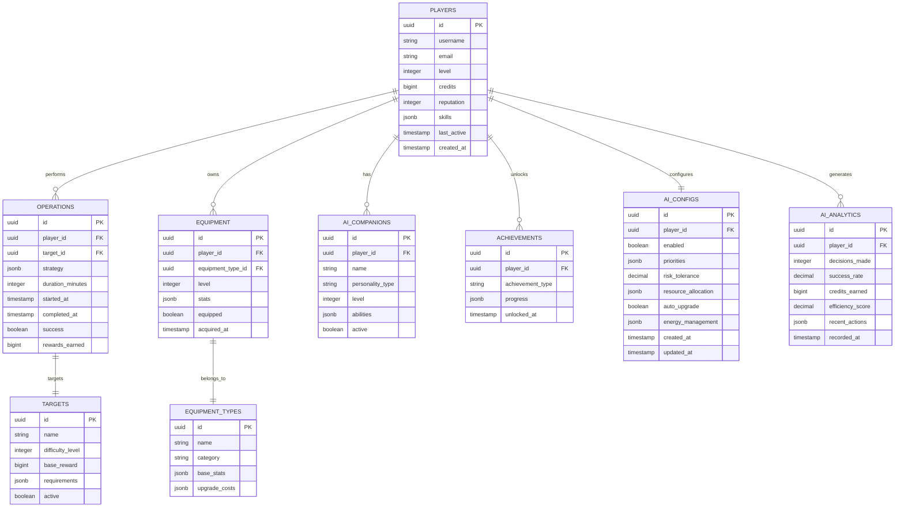

# AI Idle Hacker - Technical Architecture Document

## 1. Architecture Design


## 2. Technology Description

* Frontend: React\@18 + TypeScript + Tailwind CSS\@3 + Vite + Zustand (state management)

* Backend: Supabase (Authentication, Database, Real-time subscriptions)

* Additional: Web Workers for idle calculations, Local Storage for offline progress

## 3. Route Definitions

| Route         | Purpose                                                                   |
| ------------- | ------------------------------------------------------------------------- |
| /             | Main Dashboard - displays resources, active operations, and quick actions |
| /character    | Character Progression - skill trees, AI companions, equipment management  |
| /operations   | Hacking Operations - target browser, mission planner, attack simulator    |
| /ai-autoplay  | AI Autoplay - strategy configuration, performance analytics, override controls |
| /marketplace  | Marketplace - equipment shop, AI modules, premium store                   |
| /leaderboards | Leaderboards - global rankings, achievements, social features             |
| /settings     | Settings - game configuration, account management, tutorials              |
| /login        | Authentication - login/register with email or OAuth                       |

## 4. API Definitions

### 4.1 Core API

**Player Progress Management**

```
GET /api/player/profile
```

Response:

| Param Name   | Param Type | Description                                   |
| ------------ | ---------- | --------------------------------------------- |
| id           | string     | Player unique identifier                      |
| username     | string     | Player display name                           |
| level        | number     | Current player level                          |
| credits      | number     | Available in-game currency                    |
| reputation   | number     | Player reputation points                      |
| last\_active | timestamp  | Last activity timestamp for idle calculations |

**Hacking Operations**

```
POST /api/operations/start
```

Request:

| Param Name | Param Type | isRequired | Description                    |
| ---------- | ---------- | ---------- | ------------------------------ |
| target\_id | string     | true       | Target system identifier       |
| strategy   | object     | true       | Hacking strategy configuration |
| duration   | number     | true       | Operation duration in minutes  |

Response:

| Param Name            | Param Type | Description                   |
| --------------------- | ---------- | ----------------------------- |
| operation\_id         | string     | Unique operation identifier   |
| estimated\_completion | timestamp  | Expected completion time      |
| success\_probability  | number     | Calculated success rate (0-1) |

**Equipment and Upgrades**

```
POST /api/equipment/upgrade
```

Request:

| Param Name     | Param Type | isRequired | Description               |
| -------------- | ---------- | ---------- | ------------------------- |
| equipment\_id  | string     | true       | Equipment item identifier |
| upgrade\_level | number     | true       | Target upgrade level      |

Response:

| Param Name | Param Type | Description                  |
| ---------- | ---------- | ---------------------------- |
| success    | boolean    | Upgrade success status       |
| new\_stats | object     | Updated equipment statistics |
| cost       | number     | Credits spent on upgrade     |

**AI Autoplay Management**

```
GET /api/ai/config
```

Response:

| Param Name | Param Type | Description |
|------------|------------|-------------|
| enabled | boolean | AI autoplay activation status |
| priorities | object | AI decision-making priorities configuration |
| risk_tolerance | number | Risk level preference (0-1) |
| resource_allocation | object | Automatic resource management settings |

```
POST /api/ai/configure
```

Request:

| Param Name | Param Type | isRequired | Description |
|------------|------------|------------|-------------|
| priorities | object | true | AI behavior priorities (operations, upgrades, skills) |
| risk_tolerance | number | true | Risk preference level (0-1) |
| auto_upgrade | boolean | false | Enable automatic equipment upgrades |
| energy_management | object | false | Energy allocation strategy |

Response:

| Param Name | Param Type | Description |
|------------|------------|-------------|
| success | boolean | Configuration update status |
| active_since | timestamp | AI activation timestamp |

```
GET /api/ai/analytics
```

Response:

| Param Name | Param Type | Description |
|------------|------------|-------------|
| decisions_made | number | Total AI decisions count |
| success_rate | number | AI operation success rate |
| credits_earned | number | Credits generated by AI |
| efficiency_score | number | Overall AI performance rating |
| recent_actions | array | Last 10 AI actions with timestamps |

## 5. Data Model

### 5.1 Data Model Definition



### 5.2 Data Definition Language

**Players Table**

```sql
-- Create players table
CREATE TABLE players (
    id UUID PRIMARY KEY DEFAULT gen_random_uuid(),
    username VARCHAR(50) UNIQUE NOT NULL,
    email VARCHAR(255) UNIQUE NOT NULL,
    level INTEGER DEFAULT 1,
    credits BIGINT DEFAULT 1000,
    reputation INTEGER DEFAULT 0,
    skills JSONB DEFAULT '{}',
    last_active TIMESTAMP WITH TIME ZONE DEFAULT NOW(),
    created_at TIMESTAMP WITH TIME ZONE DEFAULT NOW(),
    updated_at TIMESTAMP WITH TIME ZONE DEFAULT NOW()
);

-- Create indexes
CREATE INDEX idx_players_email ON players(email);
CREATE INDEX idx_players_last_active ON players(last_active);
CREATE INDEX idx_players_reputation ON players(reputation DESC);

-- Grant permissions
GRANT SELECT ON players TO anon;
GRANT ALL PRIVILEGES ON players TO authenticated;
```

**Operations Table**

```sql
-- Create operations table
CREATE TABLE operations (
    id UUID PRIMARY KEY DEFAULT gen_random_uuid(),
    player_id UUID NOT NULL,
    target_id UUID NOT NULL,
    strategy JSONB NOT NULL,
    duration_minutes INTEGER NOT NULL,
    started_at TIMESTAMP WITH TIME ZONE DEFAULT NOW(),
    completed_at TIMESTAMP WITH TIME ZONE,
    success BOOLEAN,
    rewards_earned BIGINT DEFAULT 0,
    created_at TIMESTAMP WITH TIME ZONE DEFAULT NOW()
);

-- Create indexes
CREATE INDEX idx_operations_player_id ON operations(player_id);
CREATE INDEX idx_operations_completed_at ON operations(completed_at);
CREATE INDEX idx_operations_active ON operations(completed_at) WHERE completed_at IS NULL;

-- Grant permissions
GRANT SELECT ON operations TO anon;
GRANT ALL PRIVILEGES ON operations TO authenticated;
```

**Targets Table**

```sql
-- Create targets table
CREATE TABLE targets (
    id UUID PRIMARY KEY DEFAULT gen_random_uuid(),
    name VARCHAR(100) NOT NULL,
    difficulty_level INTEGER NOT NULL,
    base_reward BIGINT NOT NULL,
    requirements JSONB DEFAULT '{}',
    active BOOLEAN DEFAULT true,
    created_at TIMESTAMP WITH TIME ZONE DEFAULT NOW()
);

-- Create indexes
CREATE INDEX idx_targets_difficulty ON targets(difficulty_level);
CREATE INDEX idx_targets_active ON targets(active) WHERE active = true;

-- Grant permissions
GRANT SELECT ON targets TO anon;
GRANT ALL PRIVILEGES ON targets TO authenticated;

-- Insert initial targets
INSERT INTO targets (name, difficulty_level, base_reward, requirements) VALUES
('Local Network Router', 1, 100, '{"min_level": 1}'),
('Small Business Server', 2, 250, '{"min_level": 3}'),
('Corporate Database', 5, 1000, '{"min_level": 10}'),
('Government Firewall', 10, 5000, '{"min_level": 25}');
```

**Equipment Tables**

```sql
-- Create equipment types table
CREATE TABLE equipment_types (
    id UUID PRIMARY KEY DEFAULT gen_random_uuid(),
    name VARCHAR(100) NOT NULL,
    category VARCHAR(50) NOT NULL,
    base_stats JSONB NOT NULL,
    upgrade_costs JSONB NOT NULL,
    created_at TIMESTAMP WITH TIME ZONE DEFAULT NOW()
);

-- Create equipment table
CREATE TABLE equipment (
    id UUID PRIMARY KEY DEFAULT gen_random_uuid(),
    player_id UUID NOT NULL,
    equipment_type_id UUID NOT NULL,
    level INTEGER DEFAULT 1,
    stats JSONB NOT NULL,
    equipped BOOLEAN DEFAULT false,
    acquired_at TIMESTAMP WITH TIME ZONE DEFAULT NOW()
);

-- Create indexes
CREATE INDEX idx_equipment_player_id ON equipment(player_id);
CREATE INDEX idx_equipment_equipped ON equipment(equipped) WHERE equipped = true;

-- Grant permissions
GRANT SELECT ON equipment_types TO anon;
GRANT ALL PRIVILEGES ON equipment_types TO authenticated;
GRANT SELECT ON equipment TO anon;
GRANT ALL PRIVILEGES ON equipment TO authenticated;
```

**AI Companions Table**

```sql
-- Create AI companions table
CREATE TABLE ai_companions (
    id UUID PRIMARY KEY DEFAULT gen_random_uuid(),
    player_id UUID NOT NULL,
    name VARCHAR(100) NOT NULL,
    personality_type VARCHAR(50) NOT NULL,
    level INTEGER DEFAULT 1,
    abilities JSONB DEFAULT '{}',
    active BOOLEAN DEFAULT false,
    created_at TIMESTAMP WITH TIME ZONE DEFAULT NOW()
);

-- Create indexes
CREATE INDEX idx_ai_companions_player_id ON ai_companions(player_id);
CREATE INDEX idx_ai_companions_active ON ai_companions(active) WHERE active = true;

-- Grant permissions
GRANT SELECT ON ai_companions TO anon;
GRANT ALL PRIVILEGES ON ai_companions TO authenticated;
```

**Achievements Table**

```sql
-- Create achievements table
CREATE TABLE achievements (
    id UUID PRIMARY KEY DEFAULT gen_random_uuid(),
    player_id UUID NOT NULL,
    achievement_type VARCHAR(100) NOT NULL,
    progress JSONB DEFAULT '{}',
    unlocked_at TIMESTAMP WITH TIME ZONE,
    created_at TIMESTAMP WITH TIME ZONE DEFAULT NOW()
);

-- Create indexes
CREATE INDEX idx_achievements_player_id ON achievements(player_id);
CREATE INDEX idx_achievements_unlocked ON achievements(unlocked_at) WHERE unlocked_at IS NOT NULL;

-- Grant permissions
GRANT SELECT ON achievements TO anon;
GRANT ALL PRIVILEGES ON achievements TO authenticated;
```

**AI Configuration Table**

```sql
-- Create AI configuration table
CREATE TABLE ai_configs (
    id UUID PRIMARY KEY DEFAULT gen_random_uuid(),
    player_id UUID NOT NULL UNIQUE,
    enabled BOOLEAN DEFAULT false,
    priorities JSONB DEFAULT '{"operations": 0.6, "upgrades": 0.3, "skills": 0.1}',
    risk_tolerance DECIMAL(3,2) DEFAULT 0.5 CHECK (risk_tolerance >= 0 AND risk_tolerance <= 1),
    resource_allocation JSONB DEFAULT '{"energy_reserve": 0.2, "auto_spend_threshold": 0.8}',
    auto_upgrade BOOLEAN DEFAULT true,
    energy_management JSONB DEFAULT '{"priority_operations": true, "idle_threshold": 0.9}',
    created_at TIMESTAMP WITH TIME ZONE DEFAULT NOW(),
    updated_at TIMESTAMP WITH TIME ZONE DEFAULT NOW()
);

-- Create indexes
CREATE INDEX idx_ai_configs_player_id ON ai_configs(player_id);
CREATE INDEX idx_ai_configs_enabled ON ai_configs(enabled) WHERE enabled = true;

-- Grant permissions
GRANT SELECT ON ai_configs TO anon;
GRANT ALL PRIVILEGES ON ai_configs TO authenticated;
```

**AI Analytics Table**

```sql
-- Create AI analytics table
CREATE TABLE ai_analytics (
    id UUID PRIMARY KEY DEFAULT gen_random_uuid(),
    player_id UUID NOT NULL,
    decisions_made INTEGER DEFAULT 0,
    success_rate DECIMAL(5,4) DEFAULT 0.0000,
    credits_earned BIGINT DEFAULT 0,
    efficiency_score DECIMAL(5,4) DEFAULT 0.0000,
    recent_actions JSONB DEFAULT '[]',
    recorded_at TIMESTAMP WITH TIME ZONE DEFAULT NOW()
);

-- Create indexes
CREATE INDEX idx_ai_analytics_player_id ON ai_analytics(player_id);
CREATE INDEX idx_ai_analytics_recorded_at ON ai_analytics(recorded_at DESC);
CREATE INDEX idx_ai_analytics_efficiency ON ai_analytics(efficiency_score DESC);

-- Grant permissions
GRANT SELECT ON ai_analytics TO anon;
GRANT ALL PRIVILEGES ON ai_analytics TO authenticated;
```

